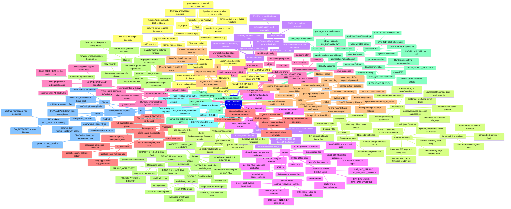

# 02 — Linux Basics · Mind Map

One diagram for the whole chapter. Render it in any Mermaid-capable viewer.

```mermaid
mindmap
  root((02 · Linux for<br/>Android Security))
    (Foundations)
      Kernel vs user space
        Only the kernel touches hardware
        svc #0 is the single doorway
        ~350 syscalls
      Shell
        Ordinary unprivileged program
        Pipeline: tokenise → alias → brace → tilde
        parameter → command sub → arithmetic
        word split → glob → quote removal
        redirection → fork/execve
        Builtins cannot be children (cd, export)
        PATH resolution and PATH hijacking
        mksh is /system/bin/sh, bash is absent
        Exit status $? drives && ||
      Terminal vs shell
        pty pair from the kernel
        adb shell allocates a pty
    (Filesystem)
      One tree from /
      Mounting hides, never deletes
      Desktop FHS
        /bin /sbin /lib /etc /var /home /opt
      Android partitions
        /system read-only + dm-verity
        /system_ext /product OEM and carrier
        /vendor /odm HALs firmware vendor_init
        /apex mainline modules
          com.android.runtime = Bionic
          com.android.art = libart, dex2oat
          com.android.conscrypt = TLS
        /data the only large writable area
        /metadata FBE keys and verity state
        virtual: /proc /sys /dev
      Inside /data
        /data/app/~~x~~/pkg-y/base.apk
        /data/data/pkg = /data/user/0/pkg
        /data/user_de/0/pkg Direct Boot
        /data/system/packages.xml packages.list
        /data/misc keystore wifi adb_keys
        /data/local/tmp mode 1777 shell writable
        /data/media/0 backs /sdcard
        /data/tombstones /data/anr
      Storage evolution
        FAT32 → sdcardfs → FUSE MediaProvider
        Scoped storage enforced API 30
        Granular media perms API 33
      CE vs DE
        CE needs first unlock
        DE readable at boot
    (Inodes and links)
      Inode holds metadata, not the name
      Directory = name → inode map
      Hard link shares the inode, link count
      Symlink stores a path string
      Attack shapes
        ZipSlip and archive traversal
        Symlink in a privileged write path
        TOCTOU in world-writable dirs
      getCanonicalPath, never getAbsolutePath
      File types - d l c b s p
    (Identity)
      UID and GID are just numbers
      Four UIDs
        real effective saved fs
      No /etc/passwd on Android
      Static AIDs in android_filesystem_config.h
        0 root · 1000 system · 2000 shell
        1001 radio · 1007 log · 1011 adb
        3003 inet = INTERNET permission
        3004 net_raw · 3009 readproc
        9999 nobody
      Dynamic app IDs
        10000-19999 apps
        50000-59999 sharedUserId gids
        99000-99999 isolated processes
        uid = userId * 100000 + appId
      sharedUserId merges two sandboxes
      Capabilities replace blanket setuid
        CAP_SYS_ADMIN CAP_DAC_OVERRIDE
        CAP_SYS_PTRACE CAP_NET_BIND_SERVICE
        CapEff line in /proc/pid/status
      SELinux
        domain from seapp_contexts
        per-app MLS categories c231,c256
        independent second layer
    (Permissions)
      12 bits
        rwx owner group other
        setuid setgid sticky
      Octal 0700 0600 0644 0755 1777 4755
      x on a directory means traverse
      umask subtracts, never adds
      chmod chown chgrp
      POSIX ACLs unused on Android
      Five-gate access decision
        traversal
        DAC bits
        SELinux type
        MLS categories
        seccomp filter
      setuid presence = modified device
        why root detection stats /system/xbin/su
    (Processes)
      task_struct: address space, fds,
        identity, signals, namespaces, cwd
      fork duplicates, execve replaces
      The gap is where privilege is dropped
      Zygote model
        preload once, fork per app
        specialise: setgroups setresuid
        capset seccomp selinux setcon
        every app's exe is app_process64
      States R S D T t Z X
      ps top pidof pkill
      VSZ is meaningless, use PSS
      Zombies are the parent's fault
    (/proc)
      Generated on read, nothing on disk
      status
        Uid Gid Groups
        TracerPid ← anti-debug
        CapEff Seccomp Threads
      maps
        libraries, heaps
        anon r-xp = JIT or unpacked payload
        rwxp = red flag
        deleted suffix = dropper
      smaps and smaps_rollup
      fd → open files, sockets, deleted files
      cmdline environ exe cwd root
      mounts and mountinfo are namespace scoped
      task/ per thread
      limits wchan syscall attr/current
      System wide
        version cpuinfo meminfo
        mounts filesystems
        net/tcp net/tcp6 net/udp net/unix
        sys/kernel/randomize_va_space
      hidepid since Android 9
      package visibility since Android 11
    (Signals)
      Asynchronous integer notifications
      Uncatchable: SIGKILL 9, SIGSTOP 19
      SIGTRAP 5 = breakpoints and single step
      SIGSEGV 11 → debuggerd → tombstone
      SIGQUIT 3 → ART Java thread dump
      SIGABRT 6 = abort, Bionic fatal
      SIGSYS 31 = seccomp violation
      SIGCHLD 17 = child exited
      Permission: matching uid or CAP_KILL
      Debugging chain
        PTRACE_ATTACH → SIGSTOP
        patch instruction with brk
        SIGTRAP on hit
        PTRACE_GETREGSET
        one tracer per process
      Anti-debug catalogue
        TracerPid poll
        PTRACE_TRACEME self-trace
        watchdog child traces parent
        SIGTRAP handler probe
        timing deltas
        maps scan for frida-agent
        port 27042 probe
    (Job control)
      Process groups and sessions
      & Ctrl-Z fg bg jobs disown
      nohup and setsid for frida-server
      Ctrl-C signals the foreground group
    (Streams and pipes)
      fd 0 1 2 always open
      dup2 between fork and execve
      Order matters: > f 2>&1
      Pipe = 64 KiB kernel buffer
      Concurrency, not sequencing
      SIGPIPE when the reader exits
      tee, here-docs, command substitution
    (IPC)
      Classic
        anonymous pipes, FIFOs
        UNIX sockets: SCM_RIGHTS fd passing
          SO_PEERCRED attested identity
          abstract namespace has no perms
        SysV and POSIX shm, mq, semaphores
        mmap MAP_SHARED
      Android
        ashmem then memfd_create with seals
        /dev/socket daemons: installd netd vold
          zygote property_service logd
        modes declared in init.rc
      Binder
        kernel stamps pid and uid
        one copy into a mapped buffer
        object refs, linkToDeath, thread pool
        ~1 MiB transaction buffer
        clearCallingIdentity pitfalls
    (Networking)
      TCP vs UDP vs QUIC
      Ports, privileged below 1024
      /proc/net/tcp hex little-endian decode
      inode joins socket to /proc/pid/fd
      netstat ss ip iptables nftables eBPF
      per-UID rules power Data Saver and VPN
      Frida 27042, IDA 23946, adbd 5555
      Block udp/443 to force TCP for Burp
    (Package management)
      apt dpkg rpm pacman on desktop
      Android: PackageManagerService + installd
      packages.xml is the database
      No post-install scripts by design
      pm list path clear grant revoke install
      dumpsys package for the full picture
    (Text tooling)
      grep sed awk find xargs
      cut sort uniq tr head tail wc tee
      strings xxd od file diff base64 sha256sum
      DEX magic dex\n039\0
    (SSH and forwarding)
      Keys not passwords, ed25519
      scp sftp
      -L local, -R remote, -D SOCKS
      adb forward and adb reverse
    (Environment and linker)
      envp inherited at execve
      /proc/pid/environ
      PATH HOME TMPDIR BOOTCLASSPATH
      Dynamic linker resolves symbols in order
      LD_PRELOAD wins by being first
        dlsym RTLD_NEXT for the real function
        ignored when AT_SECURE
        useless against Zygote-forked apps
        wrap.<pkg> property for debuggable apps
      LD_LIBRARY_PATH
      Linker namespaces restrict dlopen
    (Shell scripting)
      Shebang tells execve the interpreter
      Quote every variable
      set -eu, pipefail where available
      POSIX sh only on device
      mktemp, never predictable temp names
      Never build commands from untrusted text
    (Toybox and BusyBox)
      Multi-call binary keyed on argv[0]
      Toybox is BSD-licensed and preinstalled
      BusyBox is GPL and must be pushed
      Missing flags: -P -printf -0 --color
      Push to /data/local/tmp, not /system
    (Namespaces)
      mnt pid net ipc uts user cgroup time
      Bind mounts change the view, not the disk
      Propagation: shared private slave
      unshare CLONE_NEWNS
      /proc/pid/mounts is per-namespace
      Magisk
        magiskinit in the patched ramdisk
        bind mounts keep dm-verity intact
        DenyList unmounts inside the app's ns
        stat returns a genuine ENOENT
      Detection must move off-device
        Play Integrity
        hardware key attestation
    (Security outcomes)
      Attacker abuse
        world-writable paths
        symlink redirection
        /proc enumeration
        ptrace, signals, LD_PRELOAD, PATH
        vendor sockets, kernel bugs
      Developer mistakes
        MODE_WORLD_READABLE
        Runtime.exec string concatenation
        chmod 777
        getAbsolutePath validation
        secrets on /sdcard
        debuggable release builds
      Named CVEs
        CVE-2016-5195 Dirty COW
        CVE-2015-1805 pipe iovec
        CVE-2019-2215 binder UAF
        CVE-2022-0847 Dirty Pipe
        CVE-2014-6271 Shellshock
      MASVS mapping
        STORAGE PLATFORM CODE
        RESILIENCE PRIVACY
      Forensics
        packages.xml, tombstones, anr
        /proc volatile first
        adb_keys, mount state
```
