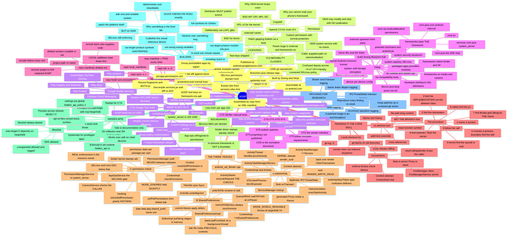

# 07 — AOSP Mind Map

One diagram covering the whole chapter. Read it alongside [README.md](README.md).

```mermaid
mindmap
  root((AOSP))

    WHAT IT IS
      ~1000 git repositories
      Assembled by repo from an XML manifest
      Built by Soong and Ninja
      Branches plus release tags
      Mainline modules update independently
      Published at android.googlesource.com
      Searchable at cs.android.com

    LICENSING
      Apache 2.0 for most of it
        Permissive
        OEM may modify and ship with NO publication
        Why you cannot read your phone's framework
      GPL v2 for the kernel
        Copyleft
        Distributor MUST publish source
        Why OEM kernel drops exist
      BSD for bionic
        Deliberately not LGPL glibc
      external/ varies
        BSD MIT GPL MPL ISC

    WHAT IS NOT IN IT
      Google Mobile Services
        Play Store
        Play services
        Play Integrity and SafetyNet
        Play Protect
        Firebase Cloud Messaging
        Gmail Maps YouTube Chrome
      OEM modifications
        Forked framework classes
        Preinstalled and carrier apps
        Device policy customisation
      Vendor and silicon
        HAL implementations
        Modem GPU DSP sensor firmware
        TEE trustlets
        Bootloader
      GTS Google Test Suite
      CONSEQUENCE
        AOSP build has no GMS
        Integrity checks behave differently
        Confirm findings on a retail device

    THE TREE
      art runtime and hidden api
      bionic libc and the linker
      build Soong Blueprint Kati
      cts compatibility tests
      device per-device config
      external upstream third party
      frameworks av media and camera
      frameworks base THE framework
        core java the SDK impl
        core java com android internal
        core jni
        core res AndroidManifest permissions
        services core java system_server
      frameworks native binder and SF
      hardware interfaces HAL definitions
      kernel Android Common Kernel
      libcore java.lang javax.net.ssl
      packages apps providers modules
      prebuilts toolchains and android.jar
      system core init adbd logd
      system security keystore2
      system sepolicy SELinux
      system vold storage encryption

    REPO AND MANIFESTS
      repo init -u -b
      repo sync -c -j
      repo manifest -r PINS every SHA
      repo forall runs everywhere
      .repo manifests default.xml
        remote fetch who supplies code
        default revision mutable or not
        project path vs name
        include follow every one
        remove-project a fork replaced AOSP
      .repo local_manifests
        LOCAL additions read these first

    READING IT THE CORE SKILL
      The procedure
        1 name a symbol
        2 find the declaration
        3 find the IMPLEMENTATION not the abstract class
        4 follow the call
        5 crosses a process boundary find the aidl
        6 find extends I Stub the server
        7 find Binder.getCallingUid THE check
        8 native find the jni
        9 kernel find the syscall or ioctl
      cs.android.com
        SET THE BRANCH first
        class function symbol
        file path lang content
        -path:test essential
        cross references
        blame and history
      Local checkout for
        git log -S
        git blame on old branches
        cross release diffing
        vendor trees not indexed anywhere
      Conventions
        Context abstract ContextImpl real
        FooManager client FooManagerService server
        Stub is server Proxy is client
        enforce throws check returns
        clearCallingIdentity drops the caller

    THE THREE TRACES
      A startActivity
        Context abstract
        ContextImpl and Activity
        Instrumentation execStartActivity
        prepareToLeaveProcess FileUriExposed
        ActivityTaskManager getService
        ServiceManager lookup
        generated Proxy writes a Parcel
        writeInterfaceToken type confusion defence
        android_util_Binder cpp
        BpBinder IPCThreadState
        ioctl BINDER_WRITE_READ
        KERNEL stamps sender_euid
        Stub onTransact
        ActivityTaskManagerService
        ActivityStarter executeRequest THE CHECKS
        back over binder ClientTransaction
        ActivityThread handleLaunchActivity
      B SharedPreferences
        ContextImpl getSharedPreferences
        data data pkg shared_prefs name.xml
        SharedPreferencesImpl
        startLoadFromDisk on a background thread
        EditorImpl putString stages in memory
        commitToMemory always synchronous
        commit blocks apply defers
        QueuedWork waitToFinish at onPause
        writeToFile rename to bak
        XmlUtils writeMapXml
        FileUtils sync fsync
        setFilePermissions then delete bak
        MODE_WORLD_READABLE throws at targetSdk 24
        bak file holds PREVIOUS contents
      C permission check
        Context checkSelfPermission is ADVISORY
        ContextImpl checkPermission
        PermissionManager path MOVED between releases
        binder kernel stamps uid
        PermissionManagerService in system_server
        permission state per package per user
        AppOpsService the SECOND gate
        MODE_IGNORED fails SILENTLY
        REAL enforcement in the resource owner
        CameraService checks the CALLER
        SELinux and Unix DAC below that
        hooking checkSelfPermission grants NOTHING

    BOUNDARIES
      binder driver stamps identity ONCE
      system_server is UID 1000
      In-process framework is NOT a boundary
      Unix DAC per app UID
      SELinux MAC per domain
      App-ops orthogonal to permissions

    HIDDEN APIS
      hide is documentation only
      SystemApi for privileged apps
      TestApi for CTS
      UnsupportedAppUsage with maxTargetSdk
      android.jar is stubs that throw
      api txt files record every surface
      Blocklist
        SDK allowed
        unsupported allowed and logged
        max-target-X depends on targetSdk
        blocked always denied
      Enforced in art runtime hidden_api cc
      On reflection and JNI lookup paths
      settings put global hidden_api_policy 1
      Works over adb on retail devices
      Persists across reboots RESET IT

    BUILDING
      envsetup lunch m
      Variants user userdebug eng
      Cuttlefish the virtual reference device
      out soong soong.variables
      out target product symbols UNSTRIPPED
      out target product module-info.json
      m snod one minute repack
      Why userdebug is the best lab
        adb root and writable system
        source matches the binary exactly
        full symbols for Ghidra
        patch the platform itself
        SELinux still enforcing
        deterministic and rebuildable
        BUT no GMS

    PATCHING FOR RESEARCH
      IPCThreadState transact logging
      Binder execTransact logging
      Permission decision logging
      bionic linker dlopen logging
      keystore2 operation logging
      Keep patches as a reviewed git series
      A patched image is an INSTRUMENT
      Reproduce every finding on stock

    TESTING A DEVICE
      Record fingerprint and BOTH patch levels
      service list diff against stock
      Group preinstalled apps by signer
      privapp-permissions xml
      Decompile services.jar and diff vs AOSP
      Extract dex from services.vdex first
      clearCallingIdentity hunt
      protectionLevel normal hunt
      SELinux permissive domain hunt
      AOSP test keys on framework-res.apk

    VULNERABILITY CLASSES
      OEM system service with no check
      Confused deputy across clearCallingIdentity
      Custom permission with normal protection
      Caller supplied path no canonicalisation
      Patch gapping bulletin as a feed
      Parser bugs in external and frameworks av
      Loosened SELinux policy
      Test keys shipped

    FORENSIC ARTEFACTS
      data system packages.xml
      data system users runtime-permissions.xml
      data system appops.xml
      shared_prefs xml and xml.bak
      data misc profiles executed methods
      data system dropbox crashes
      data tombstones native crashes
      data system usagestats

    CTS VTS GTS STS
      CTS public encodes requirements
      CTS Verifier manual tests
      VTS the vendor interface
      STS bulletin patches applied
      GTS proprietary not published
      CDD is the normative document
```
