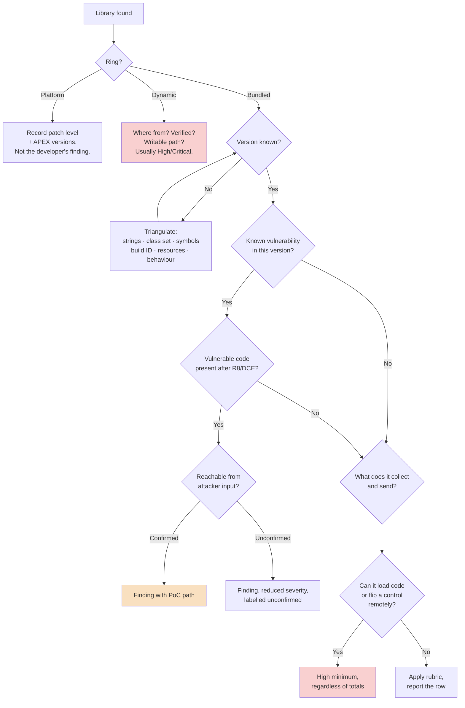

# 17 — Libraries: Mind Map

A single view of the whole chapter. Read [README.md](README.md) for the prose.

```mermaid
mindmap
  root((17 · Libraries<br/>the shared-code<br/>attack surface))
    Why libraries exist
      Problems solved
        Duplicated effort
        Duplicated memory and disk
        Unfixable duplicated bugs
      Static vs shared
        Static copied in at build time
        Shared mapped at run time
        Physical page sharing across processes
        Central patching only works for shared
      What breaks without them
        APK size explosion
        RAM multiplication
        Zygote copy-on-write model collapses
        Security patching impossible
    Three rings
      Ring 1 Platform
        /system/lib64
        /apex/*/lib64 Mainline
        /vendor/lib64 SoC and OEM
        Report OS patch level and APEX versions
      Ring 2 Bundled
        APK lib/abi/*.so
        Managed deps merged into DEX
        Frozen at build time
        Report version CVEs and behaviour
      Ring 3 Dynamic
        Downloaded DEX or .so
        assets extracted then loaded
        memfd or deleted mappings
        Usually the finding
    Bionic
      Components
        libc.so
        libm.so
        libdl.so
        linker64
        libc++ / libc++_shared
      Why it exists
        BSD licence for OEMs
        Small footprint
        Fast startup for Zygote
      vs glibc
        Scudo not ptmalloc2
        No __malloc_hook / __free_hook
        No printf %n
        No FILE vtable FSOP
        Namespaces not free dlopen
        Full RELRO and BIND_NOW
        FORTIFY on by default
        UTF-8 only no gconv modules
        Fixed resolver no NSS
        mksh not bash
      Key surfaces
        __system_property_get
        dlopen / dlsym / dl_iterate_phdr
        syscall wrappers
        TPIDR_EL0 stack canary
    Platform catalogue
      IPC
        libbinder
        libbinder_ndk
      Foundation
        libutils RefBase sp String8/16
        libcutils ashmem props sockets
        liblog
        libbase unique_fd
      Runtime glue
        libnativehelper
        libnativeloader namespace policy
        libandroid_runtime framework JNI
      Graphics
        libhwui
        Skia image decoders PNG JPEG WebP GIF
      Media
        libmedia libstagefright
        extractors in media APEX
        swcodec seccomp sandbox
      Data
        libsqlite
      Crypto and TLS
        BoringSSL libcrypto libssl
        Conscrypt APEX JCA JSSE
        CA store moved under APEX in 14
      Web
        libwebviewchromium
      Support
        libz libicu libselinux
    Loading a library
      System.loadLibrary
        caller class captured
        ClassLoader.findLibrary
        DexPathList native dirs
      ART
        Runtime.nativeLoad
        JavaVMExt::LoadNativeLibrary
      libnativeloader
        ClassLoader to namespace
        public.libraries.txt allow-list
        android_create_namespace
      Linker
        openat and mmap PT_LOAD
        r-xp text rw-p data
        DT_NEEDED recursion in namespace
        relocations rela.dyn rela.plt
        mprotect PT_GNU_RELRO
        DT_INIT_ARRAY constructors
      Then
        dlsym JNI_OnLoad
        RegisterNatives or name mangling
      Consequences
        constructors run before JNI_OnLoad
        anti-analysis lives there
        spawn do not attach
    Parsers are the danger
      Definition
        turn adversary bytes into structure
      MP4 lie catalogue
        size 0xFFFFFFFF integer overflow
        truncated box OOB read
        duplicate track id UAF or type confusion
        huge dimensions undersized frame buffer
        deep nesting stack exhaustion
        sample offset outside file
      Stagefright 2015
        CVE-2015-1538 1539
        CVE-2015-3824 3826 3827 3828 3829
        zero-click MMS reachability
      Architectural response
        mediaserver process split
        per-process SELinux domains
        swcodec seccomp
        Mainline updatable extractors
        MMS auto-retrieval off
        integer overflow sanitisation
      Lesson
        bundled parser opts out of all of it
    Third-party SDKs
      No boundary
        same process same UID
        same permissions same files
        same network same keystore
      Categories
        analytics
        crash reporting
        advertising and mediation
        attribution MMP
        payments
        push and messaging
        maps and location
        social login
        chat and support
        remote config and A/B
        image loading
        RASP and anti-fraud
      Init ContentProvider trick
        runs before Application.onCreate
        androidx.startup.InitializationProvider
        authorities cannot be obfuscated
        merged manifest is an SDK inventory
      Seven assessment questions
        what and who
        which version
        which permissions added
        what does it send and where
        what unintended data
        can it change behaviour remotely
        vulnerability history and support
    Supply chain
      Classes
        dependency confusion
        typosquatting
        maintainer account compromise
        build infrastructure compromise
        malicious by design
        abandoned package takeover
        transitive shadowing
      Documented examples
        event-stream npm 2018
        ua-parser-js npm 2021
        dependency confusion research 2021
        Heartbleed CVE-2014-0160 motivating BoringSSL
      Controls
        dependency locking
        verification-metadata.xml
        repository content filtering
        private mirror allow-list
        SBOM in CI
        OSV or NVD scanning on release config
        reproducible builds
      SBOM for mobile
        build-time from Gradle graph
        artifact-derived from the APK
        blind spots static linking shading runtime code
    Fingerprinting versions
      1 Version strings
        OpenSSL banner
        libcurl UA
        FFmpeg configure line
        libpng and zlib banners
        okhttp UA fragment
      2 Class-set comparison
        against Maven reference JARs
        APK set is a subset after R8
        find smallest superset version
      3 Native symbol sets
        SSL_ EVP_ X509_ means OpenSSL linked
        png_ jpeg_ sqlite3_ curl_ av_
        av_register_all means FFmpeg pre 4.0
        Java_ entry points
      4 ELF build ID
        correlate across apps
        compare to vendor AAR
        symbol server lookup
        tamper evidence
      5 Resources and assets
        META-INF *.version stamps
        resources.arsc strings
        baseline.prof class list
        kotlin_module metadata
        retained proguard rules
      6 Behaviour
        endpoint hosts and paths
        User-Agent header
        SharedPreferences keys
        thread names in /proc/pid/task
        log tags
      Rule
        triangulate not lookup
        report the defensible range
    Methodology
      Phase 1 Inventory
        native so per ABI
        managed package prefixes
        manifest providers and meta-data
        assets and resources
      Phase 2 Identify
        prefix to vendor map
        version fingerprint
      Phase 3 Characterise
        purpose
        permissions contributed
        components contributed
        endpoints and payloads
        remote code capability
      Phase 4 Rate
        known vulnerability
        reachability
        data sensitivity
        remote behaviour control
        maintenance
        provenance
      Phase 5 Report
        one row per library
        evidence and confidence per row
        diff against previous build
    Tooling
      Static
        unzip readelf nm strings objdump
        apktool jadx baksmali dexdump
        apkid
        gradlew dependencies and dependencyInsight
      Dynamic
        proc pid maps
        Frida enumerateModules
        frida-trace -i dlopen -I module
        objection memory list modules
        strace openat mmap mprotect
      Limits of scanners
        BoringSSL matched against OpenSSL CVEs
        shading defeats prefix matching
        static linking invisible to Gradle
        reachability never assessed
```

---

## The one-page decision flow

```mermaid
flowchart TD
    A["Library found"] --> B{"Ring?"}
    B -- "Platform" --> P["Record patch level<br/>+ APEX versions.<br/>Not the developer's finding."]
    B -- "Dynamic" --> D["Where from? Verified?<br/>Writable path?<br/>Usually High/Critical."]
    B -- "Bundled" --> C{"Version known?"}
    C -- "No" --> C1["Triangulate:<br/>strings · class set · symbols<br/>build ID · resources · behaviour"]
    C1 --> C
    C -- "Yes" --> E{"Known vulnerability<br/>in this version?"}
    E -- "No" --> F{"What does it collect<br/>and send?"}
    E -- "Yes" --> G{"Vulnerable code<br/>present after R8/DCE?"}
    G -- "No" --> F
    G -- "Yes" --> H{"Reachable from<br/>attacker input?"}
    H -- "Confirmed" --> H1["Finding with PoC path"]
    H -- "Unconfirmed" --> H2["Finding, reduced severity,<br/>labelled unconfirmed"]
    F --> I{"Can it load code<br/>or flip a control<br/>remotely?"}
    I -- "Yes" --> I1["High minimum,<br/>regardless of totals"]
    I -- "No" --> J["Apply rubric,<br/>report the row"]

    style D fill:#f9d0d0
    style I1 fill:#f9d0d0
    style H1 fill:#f9e0c0
```
