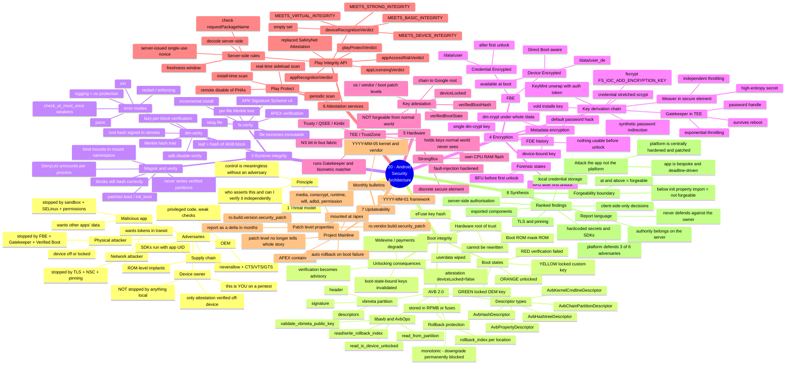

# 20 — Security Architecture · Mind Map

```mermaid
mindmap
  root((20 · Android<br/>Security<br/>Architecture))
    1 Threat model
      Adversaries
        Malicious app
          wants other apps' data
          stopped by sandbox + SELinux + permissions
        Network attacker
          wants tokens in transit
          stopped by TLS + NSC + pinning
        Physical attacker
          device off or locked
          stopped by FBE + Gatekeeper + Verified Boot
        Device owner
          this is YOU on a pentest
          NOT stopped by anything local
          only attestation verified off-device
        Supply chain
          SDKs run with app UID
          ROM-level implants
        OEM
          privileged code, weak checks
          neverallow + CTS/VTS/GTS
      Principle
        control is meaningless without an adversary
        who asserts this and can I verify it independently
    2 Boot integrity
      Hardware root of trust
        Boot ROM mask ROM
        eFuse key hash
        cannot be rewritten
      AVB 2.0
        vbmeta partition
          header
          descriptors
          signature
        Descriptor types
          AvbHashDescriptor
          AvbHashtreeDescriptor
          AvbChainPartitionDescriptor
          AvbKernelCmdlineDescriptor
          AvbPropertyDescriptor
        Rollback protection
          rollback_index per location
          stored in RPMB or fuses
          monotonic - downgrade permanently blocked
        libavb and AvbOps
          read_from_partition
          validate_vbmeta_public_key
          read/write_rollback_index
          read_is_device_unlocked
      Boot states
        GREEN locked OEM key
        YELLOW locked custom key
        ORANGE unlocked
        RED verification failed
      Unlocking consequences
        userdata wiped
        verification becomes advisory
        attestation deviceLocked=false
        boot-state-bound keys invalidated
        Widevine / payments degrade
    3 Runtime integrity
      dm-verity
        Merkle hash tree
        leaf = hash of 4KiB block
        root hash signed in vbmeta
        lazy per-block verification
        error modes
          eio
          restart / enforcing
          logging = no protection
          panic
          check_at_most_once weakens
        adb disable-verity
      Magisk and verity
        never writes verified partitions
        patches boot / init_boot
        bind mounts in mount namespace
        blocks still hash correctly
        DenyList unmounts per process
      fs-verity
        per-file Merkle tree
        file becomes immutable
        APK Signature Scheme v4
        idsig file
        incremental install
        APEX verification
    4 Encryption
      FDE history
        single dm-crypt key
        nothing usable before unlock
        default password hack
      FBE
        Device Encrypted
          /data/user_de
          available at boot
          Direct Boot aware
        Credential Encrypted
          /data/user
          after first unlock
      Key derivation chain
        credential stretched scrypt
        Gatekeeper in TEE
          password handle
          exponential throttling
          survives reboot
        Weaver in secure element
          high-entropy secret
          independent throttling
        synthetic password indirection
        KeyMint unwrap with auth token
        vold installs key
        fscrypt FS_IOC_ADD_ENCRYPTION_KEY
      Metadata encryption
        dm-crypt under whole /data
        device-bound key
      Forensic states
        BFU before first unlock
        AFU after first unlock
    5 Hardware
      TEE / TrustZone
        NS bit in bus fabric
        Trusty / QSEE / Kinibi
        holds keys normal world never sees
        runs Gatekeeper and biometric matcher
      StrongBox
        discrete secure element
        own CPU RAM flash
        fault-injection hardened
      Key attestation
        verifiedBootState
        deviceLocked
        verifiedBootHash
        os / vendor / boot patch levels
        chain to Google root
        NOT forgeable from normal world
    6 Attestation services
      Play Integrity API
        replaced SafetyNet Attestation
        deviceRecognitionVerdict
          MEETS_BASIC_INTEGRITY
          MEETS_DEVICE_INTEGRITY
          MEETS_STRONG_INTEGRITY
          MEETS_VIRTUAL_INTEGRITY
          empty set
        appRecognitionVerdict
        appLicensingVerdict
        playProtectVerdict
        appAccessRiskVerdict
        Server-side rules
          decode server-side
          check requestPackageName
          server-issued single-use nonce
          freshness window
      Play Protect
        install-time scan
        periodic scan
        real-time sideload scan
        remote disable of PHAs
    7 Updateability
      Monthly bulletins
        YYYY-MM-01 framework
        YYYY-MM-05 kernel and vendor
      Patch level properties
        ro.build.version.security_patch
        ro.vendor.build.security_patch
        report as a delta in months
      Project Mainline
        APEX containers
        mounted at /apex
        media, conscrypt, runtime, wifi, adbd, permission
        auto rollback on boot failure
        patch level no longer tells whole story
    8 Synthesis
      Attack the app not the platform
        platform is centrally hardened and patched
        app is bespoke and deadline-driven
      Ranked findings
        server-side authorisation
        local credential storage
        exported components
        client-side-only decisions
        TLS and pinning
        hardcoded secrets and SDKs
      Forgeability boundary
        below init property import = not forgeable
        at and above = forgeable
      Report language
        platform defends 3 of 6 adversaries
        never defends against the owner
        authority belongs on the server
```
