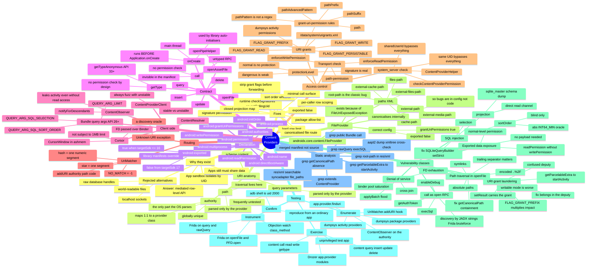

# 27 — Content Providers — Mind Map

```mermaid
mindmap
  root((Content<br/>Providers))
    Why they exist
      App sandbox isolates by UID
      Apps still must share data
      Rejected alternatives
        world-readable files
        localhost sockets
        raw database handles
      Answer: mediated row-level API
    URI anatomy
      scheme content
      authority
        the only part the OS parses
        globally unique
        maps 1:1 to a provider class
      path
        parsed only by the provider
        traversal lives here
      query parameters
        parsed only by the provider
        frequently untested
    Declaration
      android:name
      android:authorities
      android:exported
        true when targetSdk <= 16
        false from targetSdk 17
        library manifests override
      android:permission
      android:readPermission
      android:writePermission
      android:grantUriPermissions
      android:process
      android:multiprocess
      android:initOrder
      android:directBootAware
    Contract
      onCreate
        main thread
        runs BEFORE Application.onCreate
        used by library auto-initialisers
      query
      insert
      update
      delete
      getType
        no permission check by design
        getTypeAnonymous API 33+
      openFile
      openAssetFile
        openPipeHelper
      call
        no permission check
        invisible in the manifest
        untyped RPC
    Client side
      ContentResolver
      Cursor
        CursorWindow in ashmem
        FD passed over Binder
        not subject to 1MB limit
      ContentObserver
        notifyForDescendants
        leaks activity even without read access
      ContentProviderClient
        stable vs unstable
        always fuzz with unstable
      Bundle query args API 26+
        QUERY_ARG_SQL_SELECTION
        QUERY_ARG_SQL_SORT_ORDER
        QUERY_ARG_LIMIT
    Routing
      UriMatcher
        addURI authority path code
        star = one segment
        hash = one numeric segment
        NO_MATCH = -1
      Unknown URI exception
        a discovery oracle
    Access control
      system_server check
        ContentProviderHelper
        checkContentProviderPermission
        same UID bypasses everything
        sharedUserId bypasses everything
      Transport check
        enforceReadPermission
        enforceWritePermission
        path-permission
      protectionLevel
        normal is no protection
        dangerous is weak
        signature is real
      URI grants
        FLAG_GRANT_READ
        FLAG_GRANT_WRITE
        FLAG_GRANT_PERSISTABLE
        FLAG_GRANT_PREFIX
        grant-uri-permission rules
          path
          pathPrefix
          pathPattern is not a regex
          pathSuffix
          pathAdvancedPattern
        dumpsys activity permissions
        /data/system/urigrants.xml
    FileProvider
      androidx.core.content.FileProvider
      exists because of FileUriExposedException
      correct config
        exported false
        grantUriPermissions true
      paths XML
        files-path
        cache-path
        external-path
        external-files-path
        external-cache-path
        external-media-path
        root-path is the classic bug
      canonicalises internally
        so bugs are in config not code
    Vulnerability classes
      SQL injection
        selection
        projection
          direct read channel
          sqlite_master schema dump
        sortOrder
          blind only
          abs INT64_MIN oracle
        fix SQLiteQueryBuilder setStrict
      Path traversal in openFile
        encoded ..%2F
        absolute paths
        symlinks
        writable mode is worse
        fix getCanonicalPath containment
        trailing separator matters
      Exported data exposure
        no payload needed
        readPermission without writePermission
        normal-level permission
      URI grant laundering
        confused deputy
        getParcelableExtra to startActivity
        setResult carries the grant
        FLAG_GRANT_PREFIX multiplies impact
        fix belongs in the deputy
      call as open RPC
        getAuthToken
        execSql
        enableDebug
        discovery by JADX strings Frida bruteforce
      Denial of service
        cross join
        applyBatch flood
        FD exhaustion
        binder pool saturation
    Testing
      Enumerate
        dumpsys package providers
        dumpsys activity providers
        app.provider.finduri
        UriMatcher.addURI hook
        ContentObserver on the authority
      Exercise
        content query insert update delete
        content call read write gettype
        Drozer app.provider modules
        unprivileged test app
      Instrument
        Frida on query and rawQuery
        Frida on openFile and PFD.open
        Objection watch class_method
      Confirm
        adb shell is uid 2000
        reproduce from an ordinary app
    Static analysis
      merged manifest not source
      aapt2 dump xmltree cross-check
      grep extends ContentProvider
      grep public Bundle call
      grep rawQuery execSQL
      grep getCanonicalPath absence
      grep root-path in res/xml
      grep getParcelableExtra to startActivity
      res/xml searchable syncadapter file_paths
    Fixes
      exported false
      signature permission
      runtime checkSignatures on getCallingUid
      package allow-list
      per-caller row scoping
      closed projection map
      sort order whitelist
      hard row limit
      canonicalised file route
      minimal call surface
      strip grant flags before forwarding
```
