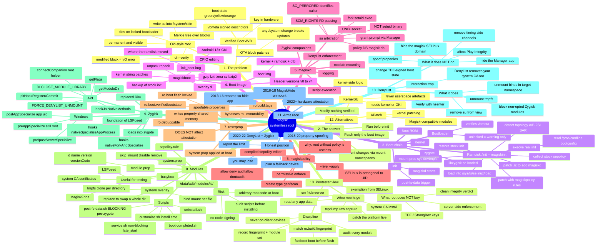

# Magisk — Mind Map

```mermaid
mindmap
  root((Magisk<br/>systemless root))
    1. The problem
      Verified Boot AVB
        vbmeta signed descriptors
        boot state green/yellow/orange
        key in hardware
      dm-verity
        Merkle tree over blocks
        modified block = I/O error
      OTA block patches
        any /system change breaks updates
      Old-style root
        write su into /system/xbin
        permanent and visible
        dies on locked bootloader
    2. The answer
      Modify nothing verified
      Patch only the boot image
      Run before init
      Present changes via mount namespaces
    3. Boot chain
      Boot ROM
      Bootloader
        verifies vbmeta
        unlocked = warning only
      Kernel
      Ramdisk /init = magiskinit
        mount proc sys devtmpfs
        read /proc/cmdline bootconfig
        detect topology A/B 2SI SAR
        collect stock sepolicy
        patch with magiskpolicy rules
        load into /sys/fs/selinux/load
        restore stock init
        patch .rc to add magiskd
        execve real init
      init
        post-fs-data trigger
        magiskd starts
      zygote
        libzygisk.so loaded
    4. Boot image
      Header versions v0 to v4
      boot.img
        kernel + ramdisk + dtb
      init_boot.img
        Android 13+ GKI
        where the ramdisk moved
      magiskboot
        unpack repack
        gzip lz4 lzma xz bzip2
        CPIO editing
        .backup of stock init
        overlay.d
        kernel string patches
    5. magiskd
      su arbitration
        UNIX socket
        SO_PEERCRED identifies caller
        policy DB magisk.db
        grant prompt via Manager
        fork setuid exec
        SCM_RIGHTS FD passing
        NOT setuid binary
      module mounting
      script execution
      DenyList enforcement
      Zygisk companions
      logging
    6. magiskpolicy
      compiled sepolicy editor
      allow deny auditallow dontaudit
      permissive enforce
      create type genfscon
      --live --apply
      why: root without policy is useless
      SELinux is orthogonal to UID
    7. resetprop
      writes property shared memory
      bypasses ro. immutability
      system.prop applied at boot
      spoofable properties
        ro.build.tags
        ro.debuggable
        ro.boot.flash.locked
        ro.boot.verifiedbootstate
      DOES NOT affect attestation
    8. Modules
      /data/adb/modules/id/
      module.prop
        id name version versionCode
      system/ overlay
        bind mount per file
        tmpfs clone per directory
        .replace to swap a whole dir
      Scripts
        customize.sh install time
        post-fs-data.sh BLOCKING pre-zygote
        service.sh non-blocking late_start
        boot-completed.sh
        uninstall.sh
      system.prop
      sepolicy.rule
      skip_mount disable remove
      Useful for testing
        system CA certificates
        MagiskFrida
        LSPosed
        busybox
      Risk
        no code signing
        arbitrary root code at boot
        audit scripts before installing
    9. Zygisk
      loads into zygote
      hooks nativeForkAndSpecialize
      hooks nativeSpecializeAppProcess
      Windows
        preAppSpecialize still root
        postAppSpecialize app uid
        pre/postServerSpecialize
      API
        getFlags
        FORCE_DENYLIST_UNMOUNT
        DLCLOSE_MODULE_LIBRARY
        connectCompanion root helper
        getModuleDir
        hookJniNativeMethods
        pltHookRegister/Commit
      replaced Riru
      foundation of LSPosed
    10. DenyList
      What it does
        unmount binds in target namespace
        unmount tmpfs
        remove su from view
        block non-opted Zygisk modules
      What it does NOT do
        spoof properties
        hide the Manager app
        hide the magisk SELinux domain
        change TEE-signed boot state
        affect Play Integrity
        remove timing side channels
      Interaction trap
        DenyList removes your system CA too
      Verify with nsenter
    11. Arms race
      2013-16 rename su hide app
      2016-18 MagiskHide unmount
      2018-20 property spoofing
      2020-22 DenyList + Zygisk
      2022+ hardware attestation
      Honest position
        you may lose
        plan a fallback device
        report the limit
    12. Alternatives
      KernelSU
        kernel-side logic
        fewer userspace artefacts
        needs kernel or GKI
      APatch
        kernel patching
        Magisk-compatible modules
    13. Pentester view
      What root buys
        read any app data
        run frida-server
        system CA install
        tcpdump raw capture
        patch the platform live
      What root does NOT buy
        server-side enforcement
        TEE / StrongBox keys
        clean integrity verdict
        exemption from SELinux
      Discipline
        fastboot boot before flash
        match ro.build.fingerprint
        audit every module
        record fingerprint + module set
        never on client devices
```
