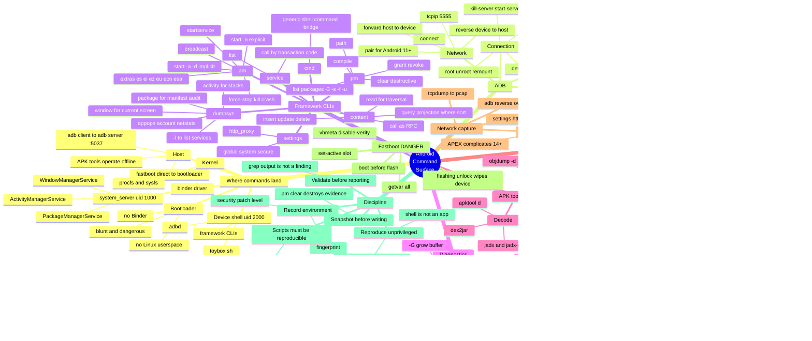

# Useful Commands — Mind Map

```mermaid
mindmap
  root((Android<br/>Command<br/>Surface))
    Where commands land
      Host
        adb client to adb server :5037
        fastboot direct to bootloader
        APK tools operate offline
      Device shell uid 2000
        adbd
        toybox sh
        framework CLIs
      system_server uid 1000
        ActivityManagerService
        PackageManagerService
        WindowManagerService
      Kernel
        binder driver
        procfs and sysfs
      Bootloader
        no Linux userspace
        no Binder
        blunt and dangerous
    ADB
      Connection
        devices -l
        kill-server start-server
        get-state
        root unroot remount
        disable-verity
      Network
        tcpip 5555
        connect
        pair for Android 11+
        forward host to device
        reverse device to host
      Transfer
        push pull
        run-as tar for debuggable apps
      Install
        -r reinstall keep data
        -t testOnly
        -d downgrade
        -g grant all permissions
        --bypass-low-target-sdk-block
        install-multiple for splits
    Framework CLIs
      pm
        list packages -3 -s -f -u
        path
        grant revoke
        clear destructive
        compile
      am
        start -n explicit
        start -a -d implicit
        broadcast
        startservice
        force-stop kill crash
        extras es ei ez eu ecn esa
      content
        query projection where sort
        insert update delete
        call as RPC
        read for traversal
      settings
        global system secure
        http_proxy
      dumpsys
        -l to list services
        package for manifest audit
        window for current screen
        activity for stacks
        appops account netstats
      service
        list
        call by transaction code
      cmd
        generic shell command bridge
    Diagnostics
      logcat
        -c clear first
        --pid filter to target
        -b all crash events radio
        -v threadtime
        -G grow buffer
      getprop
        fingerprint
        sdk and release
        security_patch
        verifiedbootstate
        debuggable and secure
        cpu.abi
      proc
        maps for libraries
        status for TracerPid
        fd for sockets and dbs
        net tcp and unix
      strace and ltrace
        finds native checks
        survives obfuscation
    APK toolchain
      Inspect
        unzip -l
        aapt2 dump badging
        aapt2 dump xmltree
        apksigner verify --print-certs
      Decode
        apktool d
        jadx and jadx-gui
        baksmali
        dex2jar
      Rebuild
        apktool b
        zipalign BEFORE signing
        apksigner sign
      Native
        strings
        readelf -d -s
        nm -D
        objdump -d
    Instrumentation
      frida
        frida-ps -Uai
        -f spawn vs -n attach
        frida-trace -i and -j
        version must match server
      objection
        sslpinning disable
        root disable
        hooking watch class_method
        keystore list
        heap search instances
        memory list modules
        sqlite connect
    Network capture
      settings http_proxy
      adb reverse over USB
      tcpdump to pcap
      CA as system cert
        subject_hash_old
        hash.0 filename
        APEX complicates 14+
    Fastboot DANGER
      getvar all
      flashing unlock wipes device
      boot before flash
      vbmeta disable-verity
      set-active slot
    Discipline
      Reproduce unprivileged
        shell is not an app
        biggest junior false positive
      Record environment
        fingerprint
        security patch level
      Snapshot before writing
        pm clear destroys evidence
      Validate before reporting
        grep output is not a finding
      Scripts must be reproducible
        colleague reruns and verifies
```
