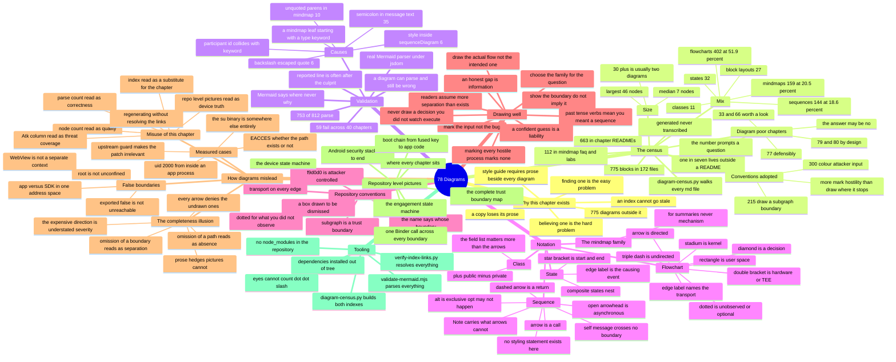

# 78 — Diagrams · Mind Map

One map of the whole chapter. Chapter: [README.md](README.md).

```mermaid
mindmap
  root((78 Diagrams))
    Why this chapter exists
      775 diagrams outside it
      finding one is the easy problem
      believing one is the hard problem
      an index cannot go stale
      a copy loses its prose
      style guide requires prose beside every diagram
    The census
      generated never transcribed
      diagram-census.py walks every md file
      775 blocks in 172 files
      663 in chapter READMEs
      112 in mindmap faq and labs
      one in seven lives outside a README
      Mix
        flowcharts 402 at 51.9 percent
        mindmaps 159 at 20.5 percent
        sequences 144 at 18.6 percent
        states 32
        block layouts 27
        classes 11
      Size
        median 7 nodes
        largest 46 nodes
        30 plus is usually two diagrams
      Conventions adopted
        215 draw a subgraph boundary
        300 colour attacker input
        more mark hostility than draw where it stops
      Diagram poor chapters
        79 and 80 by design
        77 defensibly
        33 and 66 worth a look
        the number prompts a question
        the answer may be no
    Validation
      real Mermaid parser under jsdom
      753 of 812 parse
      59 fail across 40 chapters
      Causes
        semicolon in message text 35
        unquoted parens in mindmap 10
        backslash escaped quote 6
        style inside sequenceDiagram 6
        participant id collides with keyword
        a mindmap leaf starting with a type keyword
      Mermaid says where never why
      reported line is often after the culprit
      a diagram can parse and still be wrong
    Notation
      Flowchart
        arrow is directed
        triple dash is undirected
        dotted is unobserved or optional
        edge label names the transport
        rectangle is user space
        stadium is kernel
        double bracket is hardware or TEE
        diamond is a decision
      Sequence
        arrow is a call
        dashed arrow is a return
        open arrowhead is asynchronous
        self message crosses no boundary
        alt is exclusive opt may not happen
        Note carries what arrows cannot
        no styling statement exists here
      State
        star bracket is start and end
        edge label is the causing event
        composite states nest
      Class
        plus public minus private
        the field list matters more than the arrows
      The mindmap family
        for summaries never mechanism
    Repository conventions
      subgraph is a trust boundary
      the name says whose boundary
      f9d0d0 is attacker controlled
      transport on every edge
      a box drawn to be dismissed
      dotted for what you did not observe
    Drawing well
      show the boundary do not imply it
      readers assume more separation than exists
      mark the input not the bug
      marking every hostile process marks none
      choose the family for the question
      past tense verbs mean you meant a sequence
      draw the actual flow not the intended one
      never draw a decision you did not watch execute
      an honest gap is information
      a confident guess is a liability
    How diagrams mislead
      The completeness illusion
        every arrow denies the undrawn ones
        prose hedges pictures cannot
        omission of a path reads as absence
        omission of a boundary reads as separation
        the expensive direction is understated severity
      Measured cases
        uid 2000 from inside an app process
        upstream guard makes the patch irrelevant
        EACCES whether the path exists or not
        the su binary is somewhere else entirely
      False boundaries
        app versus SDK in one address space
        exported false is not unreachable
        WebView is not a separate context
        root is not unconfined
      Misuse of this chapter
        index read as a substitute for the chapter
        node count read as quality
        Atk column read as threat coverage
        parse count read as correctness
        repo level pictures read as device truth
        regenerating without resolving the links
    Repository level pictures
      Android security stack end to end
      boot chain from fused key to app code
      where every chapter sits
      the complete trust boundary map
      one Binder call across every boundary
      the engagement state machine
      the device state machine
    Tooling
      diagram-census.py builds both indexes
      validate-mermaid.mjs parses everything
      verify-index-links.py resolves everything
      dependencies installed out of tree
      no node_modules in the repository
      eyes cannot count dot dot slash
```
